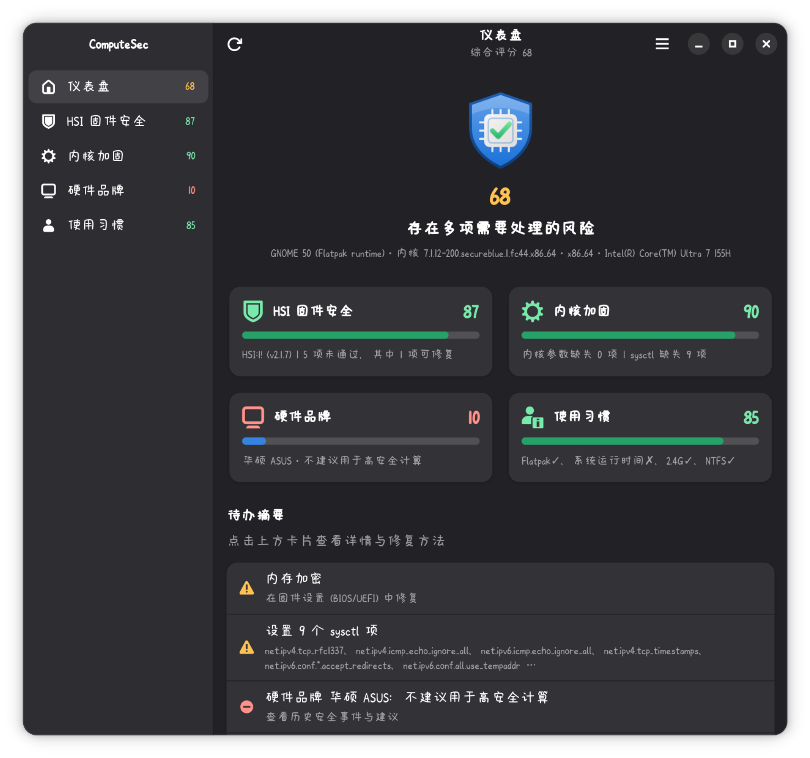

<div align="center">

# ComputeSec

<p align="center">
  
</p>

**A Linux desktop security assessment tool built with GTK4 / libadwaita / Python. It reads the state of your system, compares it against a security baseline, explains in plain language what every check means and what you risk by leaving it off, and hands you copy-and-paste fixes. Whatever you already got right is shown in green: keep it up! 🤗**

[](./LICENSE)

<p align="center">
  [🇺🇸 English] • <a href="README.md">🇨🇳 中文</a> •
  <a href="https://s.92li.uk/">🌐 Official Website</a> •
  <a href="https://github.com/lingyicute/ComputeSec/releases">📦 Download</a> •
  <a href="https://github.com/lingyicute/ComputeSec/issues">🐛 Report Bug</a>
</p>



</div>

---

## Pages

### 1. Dashboard
* **At a glance**: overall score, cards for the four assessment areas, and a summary of outstanding to-dos.

### 2. HSI Firmware Security
* **Status**: reads Host Security ID (HSI) results through the fwupd D-Bus interface (or `fwupdmgr security`).
* **Risk explanation**: describes what each attribute means and what an attacker can do when it is missing or disabled.
* **Remediation ("You can fix this" section)**:
  * Steps are grouped into **"in the operating system"** and **"in firmware setup"**.
  * Covers IOMMU, Kernel Lockdown, encrypted swap, Secure Boot, TPM, s2idle, and more.

### 3. Kernel Hardening
* **Reading and comparing state**:
  * Reads `/proc/cmdline` and `/proc/sys` (the equivalent of `sysctl -a`).
  * Compares them against the built-in recommended kargs list and sysctl hardening list for your architecture (amd64 / aarch64).
* **Quick fixes and guidance**:
  * One-click copy of the missing parameters.
  * Instructions for `grubby` / GRUB / systemd-boot / rpm-ostree.
  * Generates `/etc/sysctl.d` drop-in files together with setup instructions.
* **Architecture note**: on aarch64 it prompts you to probe the maximum usable value of `vm.mmap_rnd_bits` by hand.

### 4. Hardware Vendor
* **Vendor identification**: reads DMI / device tree to identify the hardware manufacturer.
* **Reputation database**: cross-checks a built-in vendor security reputation database, which documents incidents such as Lenovo Superfish/LSE, ASUS ShadowHammer, the MSI Boot Guard private key leak, Gigabyte's backdoor-style UEFI updater, and Dell's eDellRoot.
* **Advice**: for vendors with a tarnished record, it recommends against using them in high-security computing environments.

### 5. Usage Habits
* **Flatpak ecosystem assessment**:
  * Counts installed apps (runtimes and desktop-environment bundled packages are excluded automatically).
  * Suggests using Flatpak more if you have fewer than 5 apps.
  * Recommends Pear's [harden-flatpak](https://github.com/lingyicute/harden-flatpak) project, which denies all Flatpak permissions by default, paired with Flatseal for per-app permission hardening.
* **Uptime reminder**: when the system `uptime` exceeds one day, it reminds you to update and reboot.
* **Peripheral security check**: detects 2.4 GHz wireless receivers and warns about potential keystroke sniffing.
* **Environment isolation check**: detects NTFS partitions or a Windows installation (unauditable, and liable to contaminate your Linux environment).

## Option 1: Clone and run directly

Requirements: Python ≥ 3.9, PyGObject, GTK 4, libadwaita ≥ 1.4 (Fedora 39+ / Ubuntu 24.04+ / Debian 13+ / Arch), and `fwupd` for HSI.

```bash
# Fedora
sudo dnf install python3-gobject gtk4 libadwaita fwupd
# Debian / Ubuntu
sudo apt install python3-gi gir1.2-gtk-4.0 gir1.2-adw-1 fwupd
# Arch
sudo pacman -S python-gobject gtk4 libadwaita fwupd
```

```bash
git clone https://github.com/lingyicute/ComputeSec.git
cd ComputeSec
python3 run.py
```

To make it show up in your app menu and display the correct icon in the taskbar/dock (on Wayland the `.desktop` file must match the App ID):

```bash
python3 run.py --install     # install the .desktop file and SVG icons into ~/.local/share
python3 run.py --uninstall   # remove them
```

## Option 2: Flatpak

### Install from a release

Download the `.flatpak` for your architecture from [Releases](https://github.com/lingyicute/ComputeSec/releases):

```bash
flatpak install --user ./ComputeSec-x86_64.flatpak
flatpak run uk._92li.lingyicute.ComputeSec
```

### Build locally

```bash
flatpak install flathub org.gnome.Platform//50 org.gnome.Sdk//50
flatpak-builder --user --install --force-clean build-dir uk._92li.lingyicute.ComputeSec.json
flatpak run uk._92li.lingyicute.ComputeSec
```

### Flatpak permissions

The tool has to read information from the host, so it requests the permissions below. You can revoke any of them at any time with Flatseal — the corresponding feature will then simply report "unavailable".

| Permission | Purpose |
| --- | --- |
| `--system-talk-name=org.freedesktop.fwupd` | Read HSI results over D-Bus |
| `--talk-name=org.freedesktop.Flatpak` | Run `fwupdmgr`, `lsblk` and `flatpak list` via `flatpak-spawn --host` when needed (read-only commands only) |
| `--filesystem=/var/lib/flatpak:ro`, `~/.local/share/flatpak:ro` | Count installed Flatpak apps |
| `--filesystem=/run/udev:ro`, `/boot/efi:ro`, `/efi:ro` | Detect NTFS partitions and the Windows boot loader |

`/proc/cmdline`, `/proc/sys`, `/sys/class/dmi` and `/sys/bus/usb` are readable inside the sandbox by default and need no extra permissions.

## Project layout

```
run.py                  Launcher (for a cloned checkout; /app/bin/computesec inside Flatpak)
computesec/
  ├── main.py           Application and window, navigation, background scanning threads
  ├── ui.py             Construction of the five pages
  ├── checks.py         Data collection and comparison (fwupd, cmdline, sysctl, DMI, Flatpak, uptime, USB, NTFS)
  └── data.py           Knowledge base: HSI descriptions, kernel parameters, sysctl, vendor reputation
data/
  └── Icons and build metadata
uk._92li.lingyicute.ComputeSec.json      Flatpak manifest
.github/workflows/build.yml              Build workflow
```

## Notes

- Machine-specific boot options in the kernel parameter list — `root=`, `rootflags=`, `rw`, `rhgb`, `quiet`, `vconsole.keymap` and friends — are never evaluated. Never copy someone else's `root=UUID=...`.
- Some hardening parameters have minor side effects (for example `module.sig_enforce=1` blocks the proprietary NVIDIA driver from loading, `ia32_emulation=0` breaks Steam/Wine, and `mitigations=auto,nosmt` disables hyper-threading). Each of those is flagged with a ⚠ in the UI. It is a good idea to test them once by pressing `e` in the GRUB menu and adding them temporarily.

> [!IMPORTANT]
> For security reasons, Pear recommends against using the closed-source NVIDIA driver and closed-source kernel modules, and against running Windows programs of unknown origin under Wine.

- Vendor reputation information is drawn from public reporting and CVE records, and is provided for reference only.

## 🗂️ License

This program is released under the GNU General Public License v3.0 (GPLv3).

Copyright © 2025-2026 lingyicute.

This program is free software: you can redistribute it and/or modify
it under the terms of the GNU General Public License as published by
the Free Software Foundation, either version 3 of the License, or
(at your option) any later version.

This program is distributed in the hope that it will be useful,
but WITHOUT ANY WARRANTY; without even the implied warranty of
MERCHANTABILITY or FITNESS FOR A PARTICULAR PURPOSE.  See the
GNU General Public License for more details.

You should have received a copy of the GNU General Public License
along with this program.  If not, see https://www.gnu.org/licenses.
